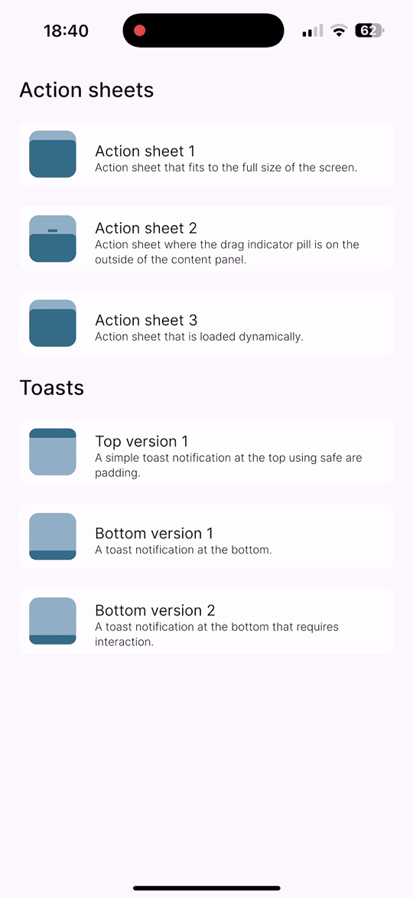

# Jc.PopupView.Avalonia

Beautiful, animinated toasts, alerts, and other popups for Avalonia UI.

---

## Table of Contents

- [Screenshots](#screenshots)
- [Introduction](#introduction)
- [Usage](#usage)
    - [Get Started](#get-started)
    - [Dialog Service](#dialog-service)
    - [Common](#common)
    - [Toasts](#toasts)
    - [Sheets](#sheets)

## Screenshots

| Toasts | Sheets | Floaters | Popups |
| --- | --- | --- | --- |
|  |  | Coming soon | Cooming soon |

## Introduction

Jc.PopupView.Avalonia is a library to bring beautiful, animated toasts, alerts, and other popups for Avalonia UI.

This includes toast popups, iOS "sheet" likes, "floaters" and regular popups designed specifically for use with Android and iOS to make your apps beautiful with ease and interactive.

## Usage

### Get Started

To use Jc.PopupView.Avalonia you must add the `Jc.PopupView.Avalonia` package to your project.

```bash
dotnet add package Jc.PopupView.Avalonia
```

Then you must add the styles to your app styles:

```xml
<Application.Styles>
    <!-- Existing Themes -->
    <popup:JcPopupView />
</Application.Styles>
```

Add a `DialogHost` control to the root of your application:

```xml
<popup:DialogHost>
    <!-- Your content goes here -->
</popup:DialogHost>
```

### Dialog Service

The dialog service implements the interface `IDialogService`:

```csharp
public interface IDialogService
{
    void OpenSheet<TContent>(TContent content, Action<Sheet>? configure = null)
        where TContent : Control;
    void CloseSheet<TContent>(TContent content) 
        where TContent : Control;
    void OpenToast<TContent>(TContent content, Action<Toast>? configure = null) 
        where TContent : Control;
    void CloseToast<TContent>(TContent content) 
        where TContent : Control;
}
```

Each open method allows you to configure the relevant control directly before opening. To close a popup, you must pass in a reference to the control the popup is displaying (the same reference passed into the open method).

### Common

Common popup properties to be configured:

| Property | Default | Description |
| --- | --- | --- |
| IsOpen | false | Whether the popup is open - setting this value triggers animations |
| AnimationDuration | 0:0:0.2 | Popup animation duration |
| Easing | CubicEaseOut | Animation easing function |
| ClickOnOutsideToDismiss | false | Clicking outside the popup closes the popup |
| ClickToDismiss | false | Clicking the popup itself closes the popup |
| ShowBackgroundMask | true | Shows the popup background mask |
| MaskColor | | The color of the background mask |

### Toasts
```xml
<popup:DialogHost.Toasts>
    <popup:Toast>
        <!-- Toast content -->
    </popup:Toast>
</popup:DialogHost.Toasts>
```

Toasts can be configured as:

| Property | Default | Description |
| --- | --- | --- |
| ClickToDismiss | true | Clicking the popup itself closes the popup |
| ShowBackgroundMask | false | Shows the popup background mask |
| Location | Top | The location the toast appears (Top or Bottom) |


### Sheets
```xml
<popup:DialogHost.Sheets>
    <!-- Sheets -->
    <popup:Sheet>
        <!-- Sheet content -->
    </popup:Sheet>
</popup:DialogHost.Sheets>
```

Sheets can be configured as:

| Property | Default | Description |
| --- | --- | --- |
| AnimationDuration | 0:0:0.5 | Popup animation duration |
| ClickToDismiss | false | Attempting to set this on a sheet results in an invalid operation exception |
| PillLocation | Internal | Location of the drag indicator pill (Internal or External) |
| PillColor | | The color of the drag indicator pill |
