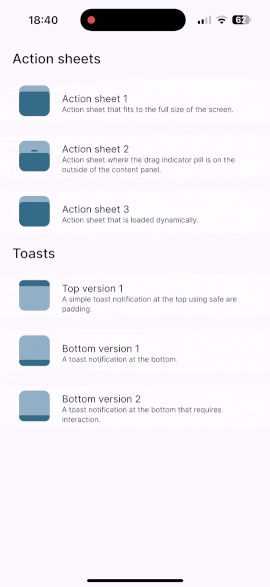
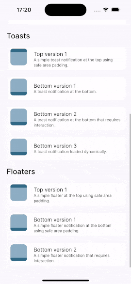

# Jc.PopupView.Avalonia

Beautiful, animinated toasts, alerts, and other popups for Avalonia UI.

---

## Table of Contents

- [Screenshots](#screenshots)
- [Introduction](#introduction)
- [Usage](#usage)
    - [Get Started](#get-started)
    - [Native](#native)
      - [Platform Support](#platform-support)
      - [Screenshots](#native-screenshots)
    - [Dialog Service](#dialog-service)
    - [Common](#common)
    - [Toasts](#toasts)
    - [Sheets](#sheets)
    - [Floaters](#floaters)

## Screenshots

| Toasts | Sheets | Floaters | Popups |
| --- | --- | --- | --- |
|  |  |  | Cooming soon |

## Introduction

Jc.PopupView.Avalonia is a library to bring beautiful, animated toasts, alerts, and other popups for Avalonia UI.

This includes toast popups, iOS "sheet" likes, "floaters" and regular popups designed specifically for use with Android and iOS to make your apps beautiful with ease and interactive.

## Usage

### Get Started

To use Jc.PopupView.Avalonia you must add the `Jc.PopupView.Avalonia` package to your project.

```bash
dotnet add package Jc.PopupView.Avalonia
```

Then you must add the styles to your app styles:

```xml
<Application.Styles>
    <!-- Existing Themes -->
    <popup:JcPopupView />
</Application.Styles>
```

Add a `DialogHost` control to the root of your application:

```xml
<popup:DialogHost>
    <!-- Your content goes here -->
</popup:DialogHost>
```

### Native

> **Note:** The native API is in still in preview and subject to change.

To use native dialogs you must add the `Jc.PopupView.Avalonia.Native` package to your project.

```bash
dotnet add package Jc.PopupView.Avalonia.Native
```

and the `Jc.PopupView.Avalonia.Native.X` package to your platform speciifc project(s).

```bash
dotnet add package Jc.PopupView.Avalonia.Native.Android
dotnet add package Jc.PopupView.Avalonia.Native.iOS
```

Then call `UseNativePopups()` on your `AppBuilder`, passing `this` context in for Android.

You can then use `Native.BottomSheetService.Current` to open a native dialog:

```csharp
Native.Current.BottomSheetService.ShowBottomSheet(new TextBlock { Text = "Hello, from native bottom sheet!" });
```

#### Platform Support

| Platform | Bottom Sheet |
| ---|---|
| Android | ✓ |
| Desktop | ☓ |
| iOS | ✓ |

#### Native Screenshots

|  | Android | iOS |
| --- | --- | --- |
| Bottom Sheets |  |  |


### Dialog Service

The dialog service implements the interface `IDialogService`:

```csharp
public interface IDialogService
{
    void OpenSheet<TContent>(TContent content, Action<Sheet>? configure = null)
        where TContent : Control;
    void CloseSheet<TContent>(TContent content)
        where TContent : Control;
    void OpenToast<TContent>(TContent content, Action<Toast>? configure = null)
        where TContent : Control;
    void CloseToast<TContent>(TContent content)
        where TContent : Control;
    void OpenFloater<TContent>(TContent content, Action<Floater>? configure = null)
        where TContent : Control;
    void CloseFloater<TContent>(TContent content)
        where TContent : Control;

    Task<IPopupHandle> ShowToastAsync<TContent>(
        TContent content,
        Action<Toast>? configure = null,
        CancellationToken cancellationToken = default)
        where TContent : Control;

    Task<IPopupHandle> ShowFloaterAsync<TContent>(
        TContent content,
        Action<Floater>? configure = null,
        CancellationToken cancellationToken = default)
        where TContent : Control;

    Task<IPopupHandle> ShowSheetAsync<TContent>(
        TContent content,
        Action<Sheet>? configure = null,
        CancellationToken cancellationToken = default)
        where TContent : Control;

    Task<TResult?> ShowSheetForResultAsync<TResult, TContent>(
        TContent content,
        Action<Sheet>? configure = null,
        CancellationToken cancellationToken = default)
        where TContent : Control, IPopupResultSource;

    Task<TResult?> ShowToastForResultAsync<TResult, TContent>(
        TContent content,
        Action<Toast>? configure = null,
        CancellationToken cancellationToken = default)
        where TContent : Control, IPopupResultSource;

    Task<TResult?> ShowFloaterForResultAsync<TResult, TContent>(
        TContent content,
        Action<Floater>? configure = null,
        CancellationToken cancellationToken = default)
        where TContent : Control, IPopupResultSource;

    Task<bool> DismissTopMostAsync(CancellationToken cancellationToken = default);
}
```

`Open*`/`Close*` methods remain available for direct control-based usage. The new async `Show*Async` APIs provide transient-style handles, options, and top-most dismissal.

`IPopupHandle` can be used to dismiss a specific popup instance:

```csharp
var handle = await dialogService.ShowToastAsync(
    new ToastContent(),
    toast =>
    {
        toast.Location = ToastLocation.Bottom;
        toast.ClickOutsideToDismiss = true;
    });

await handle.DismissAsync();
```

For result-based popups, implement `IPopupResultSource` on your content and use the corresponding `Show*ForResultAsync` method.

Configuration for `Show*Async` and `Show*ForResultAsync` is done by passing the same popup-specific configure actions used by `Open*` methods (`Action<Sheet>`, `Action<Toast>`, `Action<Floater>`).

### Common

Common popup properties to be configured:

| Property | Default | Description |
| --- | --- | --- |
| IsOpen | false | Whether the popup is open - setting this value triggers animations |
| AnimationDuration | 0:0:0.2 | Popup animation duration |
| Easing | CubicEaseOut | Animation easing function |
| ClickOnOutsideToDismiss | false | Clicking outside the popup closes the popup |
| ClickToDismiss | false | Clicking the popup itself closes the popup |
| ShowBackgroundMask | true | Shows the popup background mask |
| MaskColor | | The color of the background mask |

### Toasts

Toasts are simple, edge-bound popups normally used to indicate information to the user in a non-obtrusive way.

```xml
<popup:DialogHost.Toasts>
    <popup:Toast>
        <!-- Toast content -->
    </popup:Toast>
</popup:DialogHost.Toasts>
```

Toasts can be configured as:

| Property | Default | Description |
| --- | --- | --- |
| ClickToDismiss | true | Clicking the popup itself closes the popup |
| ShowBackgroundMask | false | Shows the popup background mask |
| Location | Top | The location the toast appears (Top or Bottom) |


### Sheets

Sheets arise from the bottom of the screen, behaving in a stackable way. They provide a means of laying content over the top of previous content that can be dismissed via drags.

```xml
<popup:DialogHost.Sheets>
    <!-- Sheets -->
    <popup:Sheet>
        <!-- Sheet content -->
    </popup:Sheet>
</popup:DialogHost.Sheets>
```

Sheets can be configured as:

| Property | Default | Description |
| --- | --- | --- |
| AnimationDuration | 0:0:0.5 | Popup animation duration |
| ClickToDismiss | false | Attempting to set this on a sheet results in an invalid operation exception |
| PillLocation | Internal | Location of the drag indicator pill (Internal or External) |
| PillColor | | The color of the drag indicator pill |
| Detents | null | Optional list of sheet detents (fractions or absolute heights) |
| InitialDetent | null | Optional initial detent (fraction or absolute height) |
| SnapPoint | null | Optional max-height snap point (fraction or absolute height) |

### Floaters

Floaters are similar to toasts but are not fixed to the edges of the display and so appear to "float".

```xml
<popup:DialogHost.Floaters>
    <!-- Floaters -->
    <popup:Floater>
    <!-- Floter content -->
    </popup:Floater>
</poppDialogHost.Floaters>
```

Floaters can be configred as:

| Property | Default | Description |
| --- | --- | --- |
| ClickToDismiss | true | Clicking the popup itself closes the popup |
| ShowBackgroundMask | false | Shows the popup background mask |
| Location | Top | The location the floater appears (Top or Bottom) |
| ShadowOffsetX | 0 | The drop shadow offset along the X axis |
| ShadowOffsetY | 5 | The drop shadow offset along the Y axis |
| ShadowColor | #3a000000 | The drop shadow color |
| Padding | 15 15 15 15 | The space between the floater and the end of the screen |
